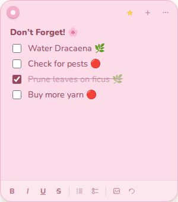
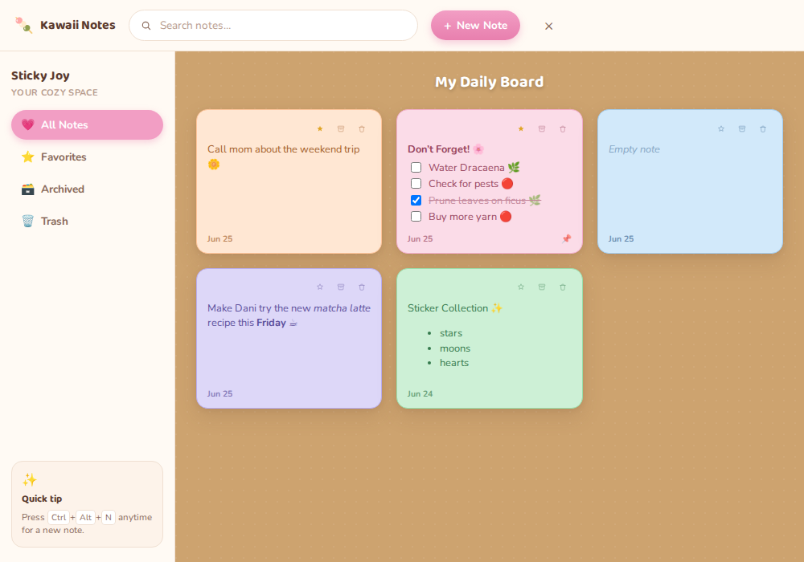

# Kawaii Sticky Notes 🍡

A desktop Sticky Notes app for Linux with all the core functionality of
Windows' Sticky Notes — multiple floating notes, rich text, checklists,
images, colors, favorites, archive & trash — wrapped in a cute pastel
"kawaii" look.




## Features

- **Floating sticky notes** — each note is its own small, frameless,
  rounded, draggable window, just like Windows Sticky Notes.
- **Rich text** — bold, italic, underline, strikethrough.
- **Checklists** — click the checklist button to add tickable to‑do items;
  checking one strikes it through. Press Enter for a new item, Backspace on
  an empty item to remove it.
- **Bulleted lists.**
- **Images** — insert via the toolbar button, or drag a picture straight
  onto a note.
- **6 pastel colors** per note (pink, lavender, mint, peach, sky, lemon).
- **Favorites** — star any note.
- **Archive & Trash** — archive notes you don't need on screen, or trash
  them (with confirmation if they have content). Restore or permanently
  delete from Trash any time.
- **"Keep on top"** — pin an individual note above other windows.
- **All Notes board** — a cork‑board style overview of every note, with a
  sidebar for All Notes / Favorites / Archived / Trash, and a search box.
- **System tray icon** — quick "New Note" / "Show All Notes" / "Quit", and
  the app keeps running in the tray even with no notes open, like the real
  Sticky Notes.
- **Global shortcut** — <kbd>Ctrl+Alt+N</kbd> creates a new note from
  anywhere.
- Notes autosave locally to a JSON file — nothing leaves your machine, no
  account, no sync.

## Requirements

- Linux (tested for X11/Wayland desktops with a compositor — GNOME, KDE,
  XFCE, Cinnamon, etc. all work; window transparency/shadow quality depends
  on your compositor).
- [Node.js](https://nodejs.org) 18 or newer (includes npm).

## Run it (development mode)

```bash
cd kawaii-sticky-notes
npm install
npm start
```

That's it — the app will start in your system tray with a welcome note.

## Build a Linux installer (AppImage / .deb)

This packages everything into a single app you can install or run on any
Linux machine, no Node.js required by the end user.

```bash
npm run dist            # builds both AppImage and .deb into ./release
npm run dist:appimage   # AppImage only
npm run dist:deb        # .deb only
```

After building:

- **AppImage**: `chmod +x release/*.AppImage` then double‑click it, or run
  it from a terminal. Optionally drop it somewhere permanent like
  `~/Applications/`.
- **.deb**: `sudo apt install ./release/*.deb` (or `dpkg -i`) to install it
  system‑wide with a proper entry in your applications menu.

> The very first `npm install` needs internet access to download Electron
> itself (~150 MB) — that part can't be avoided, but everything else
> (fonts, icons) is already bundled in the project so the app works fully
> offline afterwards.

## Where your notes are stored

Notes are saved as plain JSON at:

```
~/.config/kawaii-sticky-notes/notes.json
```

(That's Electron's standard per‑app `userData` folder on Linux.) Back this
file up or copy it to another machine to carry your notes over — there's
no cloud sync built in.

## Project layout

```
main.js                 → Electron main process: windows, tray, IPC, persistence
preload.js               → secure bridge exposing notesAPI / windowAPI to renderers
src/store.js              → tiny JSON-file backed notes "database"
src/note/                → an individual sticky-note window (HTML/CSS/JS)
src/overview/             → the "All Notes" cork-board window (HTML/CSS/JS)
src/shared/theme.css      → shared design tokens, color palette, fonts
assets/                  → bundled fonts (Baloo 2 + Nunito) and icons
build/icon.png           → 1024×1024 app icon used by electron-builder
scripts/make_icons.py    → regenerates the icon set if you want to tweak it
```

## Notes on the design

Colors, layout and type are modeled on the "Kawaii Notes" board reference
you provided — warm cream backgrounds, a cork‑board overview, soft pastel
note cards, and the "Sticky Joy" sidebar branding. Fonts (Baloo 2 for
headings, Nunito for body text) are bundled locally as `.woff2` files so
the app never needs internet access to render correctly.

## Tinkering

- Note colors live in `src/shared/theme.css` as CSS variables — add a 7th
  color by adding a `--mycolor-bg/border/text` triplet there, a
  `.note[data-color="mycolor"]` rule in `note.css`/`overview.css`, and a
  swatch button in `note.html`.
- Keyboard shortcut is registered in `main.js` via `globalShortcut.register`.
